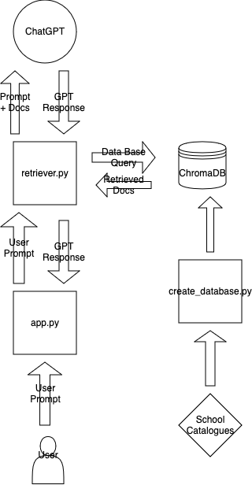

# AlamaAI

Welcome to the Alama AI repository! 

Below are the steps to get Alama AI chat working locally on your computer.

### Create Conda Environment

```
cd AlamaAI
conda env create -f environment.yml
conda activate alama
```

**Note that this process make take a few minutes to complete**

### OPENAI API KEY

Note that an OpenAI API key is needed to run the chatbot. To do this create a `.env` file in `backend` and store your API key in the file as `OPEN_AI_KEY`.

This should look like this in the `.env` environment

`OPEN_AI_KEY = 123456`

**Edit**: API key only works with a premium subscription, so we will need to share a key if you don't have one!

This key can be found here: https://platform.openai.com/api-keys

### Populate Chroma DB
```
cd backend
python create_database.py
```
This populates the embedding vector database with the example course data from Lingustics to provide context for ChatGPT.

### Run App

To run the Streamlit webapp locally, from the AlamaAI directory, run:

```
streamlit run app.py
```

### App Dependency Diagram



### References

Langchain API: https://python.langchain.com/v0.2/docs/introduction/

ChromaDB: https://docs.trychroma.com/getting-started

RAG Overview: https://www.promptingguide.ai/techniques/rag

Quick Rag Setup with LangChain: https://www.metadocs.co/2024/03/26/deploy-a-rag-application-with-langchain-streamlit-and-openai-in-10-min/ 
